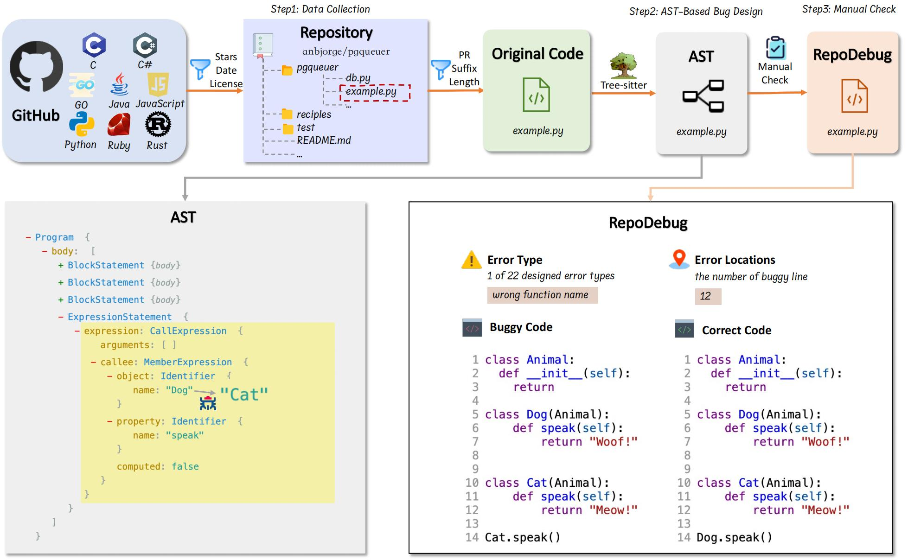

# RepoDebug

[](https://2025.emnlp.org/)

This repository contains the code and data for our paper **"RepoDebug: Repository-Level Multi-Task and Multi-Language Debugging Evaluation of Large Language Models**, which has been accepted to [EMNLP Findings 2025](https://2025.aclweb.org/).



## 📄 Citation
If you use our work, please cite:
```bibtex
@inproceedings{liu-etal-2025-repodebug,
    title = "RepoDebug: Repository-Level Multi-Task and Multi-Language Debugging Evaluation of Large Language Models",
    author = "Liu, Jingjing  and
      Liu, Zeming  and
      Cheng, Zihao  and
      He, Mengliang  and
      Shi, Xiaoming  and
      Guo, Yuhang  and
      Zhu, Xiangrong  and
      Guo, Yuanfang  and
      Wang, Yunhong  and
      Wang, Haifeng",
    editor = "Christodoulopoulos, Christos  and
      Chakraborty, Tanmoy  and
      Rose, Carolyn  and
      Peng, Violet",
    booktitle = "Findings of the Association for Computational Linguistics: EMNLP 2025",
    month = nov,
    year = "2025",
    address = "Suzhou, China",
    publisher = "Association for Computational Linguistics",
    url = "https://aclanthology.org/2025.findings-emnlp.1294/",
    doi = "10.18653/v1/2025.findings-emnlp.1294",
    pages = "23784--23813",
    ISBN = "979-8-89176-335-7",
}
